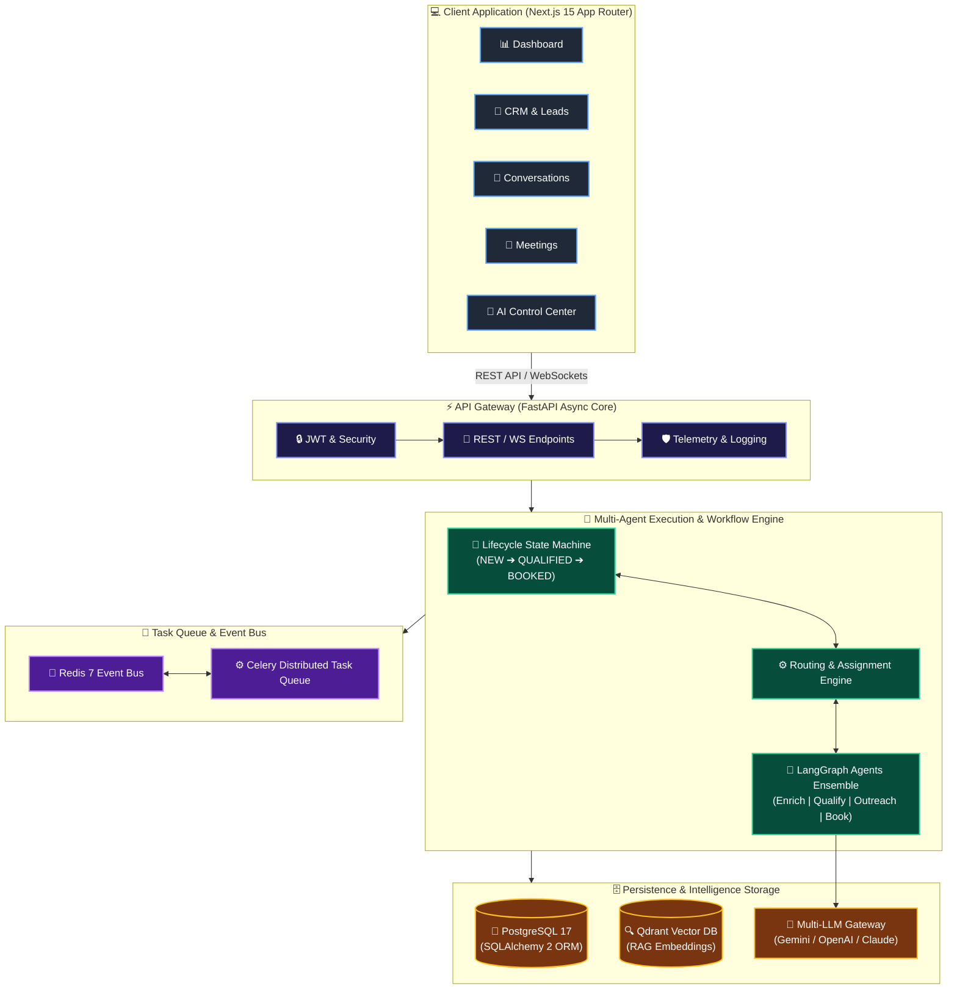
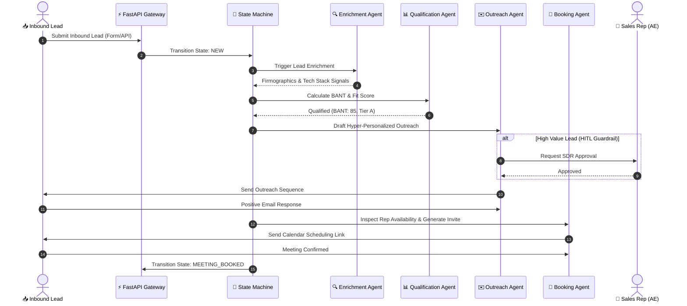

<div align="center">

# 🚀 SalesOS AI

### *Autonomous Multi-Agent Sales Operations Platform*

[](https://github.com/Devansh-Bansal-AI/SalesOS-AI)
[](https://python.org)
[](https://fastapi.tiangolo.com)
[](https://nextjs.org)
[](https://postgresql.org)
[](https://docker.com)
[](LICENSE)

<p align="center">
  <b>An end-to-end, self-operating Sales Development Representative (SDR) and SalesOps platform.</b><br/>
  Orchestrating specialized AI agents, LangGraph workflows, real-time CRM routing, and multi-channel outreach.
</p>

[📌 Overview](#-overview) • [🤖 AI Agents](#-autonomous-ai-agents) • [🏗️ Architecture](#%EF%B8%8F-system-architecture) • [⚡ Flow](#-autonomous-execution-flow) • [🚀 Features](#-key-features) • [🛠️ Tech Stack](#%EF%B8%8F-technology-stack) • [⚡ Quick Start](#-quick-start) • [📂 Structure](#-repository-structure)

---

</div>

## 📌 Overview

**SalesOS AI** transforms raw inbound leads and outbound target accounts into qualified revenue opportunities. By combining **LangGraph multi-agent orchestration**, deterministic state machines, and real-time CRM integrations, SalesOS AI acts as a 24/7 autonomous Sales Development Representative (SDR) — enriching, qualifying, communicating, and booking meetings automatically.

> [!IMPORTANT]
> **Production-Grade Engineering Principles**
> - **Determinism First**: Business logic & routing rules are 100% deterministic; AI acts in an advisory capacity.
> - **Human-in-the-Loop (HITL)**: High-value deals can trigger approval gates for sales reps before outreach is dispatched.
> - **LLM Provider Agnostic**: Seamless failover across **Google Gemini 2.0**, **OpenAI GPT-4o**, and **Anthropic Claude**.
> - **Full Auditability**: Every agent decision, prompt execution, and state change is immutably logged for complete transparency.

---

## 🤖 Autonomous AI Agents

SalesOS AI runs an ensemble of specialized, single-responsibility AI agents orchestrated via LangGraph:

| Agent | Capabilities & Responsibility | Key Outputs |
| :--- | :--- | :--- |
| 🔍 **Lead Enrichment** | Scrapes and synthesizes firmographic, technographic, employee size, and social intelligence from lead domains and public APIs. | `Company Profile`<br/>`Tech Stack Signals`<br/>`Domain Intent` |
| 📊 **Lead Qualification** | Evaluates BANT criteria (Budget, Authority, Need, Timeline) and calculates Ideal Customer Profile (ICP) alignment scores. | `BANT Score (0-100)`<br/>`Fit Rating (A/B/C/D)`<br/>`Route Priority` |
| ✉️ **Outreach Sequence** | Crafts hyper-personalized cold outreach emails, value-prop follow-ups, and handles multi-turn email objection resolution. | `Personalized Copy`<br/>`Sequence Cadence`<br/>`Objection Handler` |
| 📅 **Smart Booking** | Inspects rep calendar availability in real time, manages timezone conversion, and generates calendar demo invitations. | `Available Slots`<br/>`Calendar Event`<br/>`Prep Summary` |
| 💡 **Conversation Intelligence** | Analyzes email chains, call transcripts, and buyer sentiment to generate Next Best Actions (NBAs) and flag deal risks. | `Sentiment Index`<br/>`Deal Health (0-100)`<br/>`Next Best Action` |

---

## 🏗️ System Architecture



---

## ⚡ Autonomous Execution Flow



---

## 🚀 Key Features

- 🔄 **Deterministic Lead Lifecycle State Machine**: Immutably tracks lead progression (`NEW` ➔ `ENRICHED` ➔ `QUALIFIED` ➔ `CONTACTED` ➔ `MEETING_BOOKED` ➔ `CLOSED_WON`).
- 👥 **Dynamic Rep Routing**: Automatically assigns leads to sales reps based on territory, SLA capacity, and domain expertise.
- 🚨 **SLA Breach Monitoring**: Real-time Celery background workers monitor unhandled leads and trigger escalation notifications.
- 🛡️ **Human-in-the-Loop (HITL)**: Configurable safety policies that hold high-tier outreach for human SDR review.
- 💬 **Multi-Channel Hub**: Centralized Next.js 15 UI for monitoring email threads, meeting transcripts, and AI activity.
- 📊 **Real-time Analytics**: Pipeline velocity, conversion funnel metrics, agent accuracy, and rep performance metrics.

---

## 🛠️ Technology Stack

| Component | Technology | Version | Purpose |
| :--- | :--- | :--- | :--- |
| **Backend Framework** | [FastAPI](https://fastapi.tiangolo.com/) | `0.115+` | High-performance async REST API & WebSocket server |
| **Language** | [Python](https://www.python.org/) | `3.12+` | Primary backend language |
| **Frontend** | [Next.js](https://nextjs.org/) | `15.0+` | Workspace App Router & modern dashboard UI |
| **UI Library** | [React](https://react.dev/) / [TailwindCSS](https://tailwindcss.com/) | `19.0+` | Responsive dark-mode workspace components |
| **Relational DB** | [PostgreSQL](https://www.postgresql.org/) | `17.0+` | Primary relational database with SQLAlchemy 2 ORM |
| **Cache & Bus** | [Redis](https://redis.io/) | `7.0+` | Event bus, session management & Celery broker |
| **Async Queues** | [Celery](https://docs.celeryq.dev/) | `5.4+` | Distributed background tasks & SLA monitors |
| **Vector DB** | [Qdrant](https://qdrant.tech/) | `1.10+` | Semantic RAG search & knowledge base embeddings |
| **AI Orchestration** | [LangGraph](https://www.langchain.com/langgraph) | `0.2+` | Stateful multi-agent graph workflows |
| **Primary LLM** | [Google Gemini](https://ai.google.dev/) | `gemini-2.0-flash` | High-speed multimodal intelligence & function calling |
| **Secondary LLMs** | [OpenAI](https://openai.com/) / [Anthropic](https://anthropic.com) | `GPT-4o` / `Claude 3.5` | Failover & specialized agent reasoning |

---

## ⚡ Quick Start

### Prerequisites
- [Docker & Docker Compose](https://www.docker.com/)
- [Python 3.12+](https://www.python.org/)
- [Node.js 20+](https://nodejs.org/)

### 1. Clone & Configure Environment

```bash
git clone https://github.com/Devansh-Bansal-AI/SalesOS-AI.git
cd SalesOS-AI

# Create environment file from template
cp .env.example .env
```

> [!TIP]
> Open `.env` and set your `GEMINI_API_KEY` to enable AI agent features.

### 2. Start Infrastructure Services

```bash
# Spin up PostgreSQL, Redis, Qdrant & Celery services
make up

# Apply database migrations
make migrate
```

### 3. Launch Application

```bash
# Terminal 1: Start Backend API (http://localhost:8000/docs)
make dev-backend

# Terminal 2: Start Frontend Workspace App (http://localhost:3000)
make dev-frontend
```

---

## 🛠️ Makefile Commands

| Command | Description |
| :--- | :--- |
| `make help` | Display list of available Makefile targets |
| `make up` | Start Docker infrastructure containers (`postgres`, `redis`, `qdrant`) |
| `make down` | Stop and remove all Docker containers |
| `make migrate` | Apply Alembic database migrations |
| `make dev-backend` | Run FastAPI backend development server with auto-reload |
| `make dev-frontend` | Run Next.js frontend workspace development server |
| `make test` | Run complete backend pytest suite |
| `make lint` | Run code quality linters (Ruff, ESLint) |

---

## 📂 Repository Structure

```text
SalesOS-AI/
├── backend/
│   ├── alembic/              # Database schema migrations
│   ├── app/
│   │   ├── agents/           # LangGraph multi-agent implementations
│   │   ├── api/v1/           # FastAPI API endpoints (Auth, Leads, Meetings, Sales Execution)
│   │   ├── core/             # Application config, security, logging, telemetry
│   │   ├── db/               # Database, Redis & Qdrant connections
│   │   ├── events/           # Event bus handlers & domain events
│   │   ├── models/           # SQLAlchemy ORM models
│   │   ├── repositories/     # Data repository layer
│   │   ├── schemas/          # Pydantic schema validation
│   │   ├── services/         # Core business logic, assignment & decision engines
│   │   ├── tasks/            # Celery async tasks & SLA monitors
│   │   └── workflows/        # Lead lifecycle state machine engine
│   ├── tests/                # Integration and unit tests
│   ├── pyproject.toml        # Dependencies management
│   └── uv.lock               # uv lockfile
├── frontend/
│   ├── src/
│   │   ├── app/              # Next.js App Router (Dashboard, Leads, Conversations, Meetings, AI)
│   │   ├── components/       # Workspace UI components (Sidebar, Topbar, Lead Cards)
│   │   └── lib/              # API client, auth & hooks
│   └── package.json
├── docker/                   # Container definitions (Backend, Frontend, Worker)
├── Makefile                  # Local environment orchestration
├── .env.example              # Environment variables template
└── README.md                 # Project documentation
```

---

## 🛡️ License

Distributed under the **MIT License**. See [`LICENSE`](LICENSE) for details.

---

<div align="center">
  <sub>Built with ❤️ by <b>Devansh Bansal</b> using FastAPI, Next.js, and Google Gemini.</sub>
</div>
