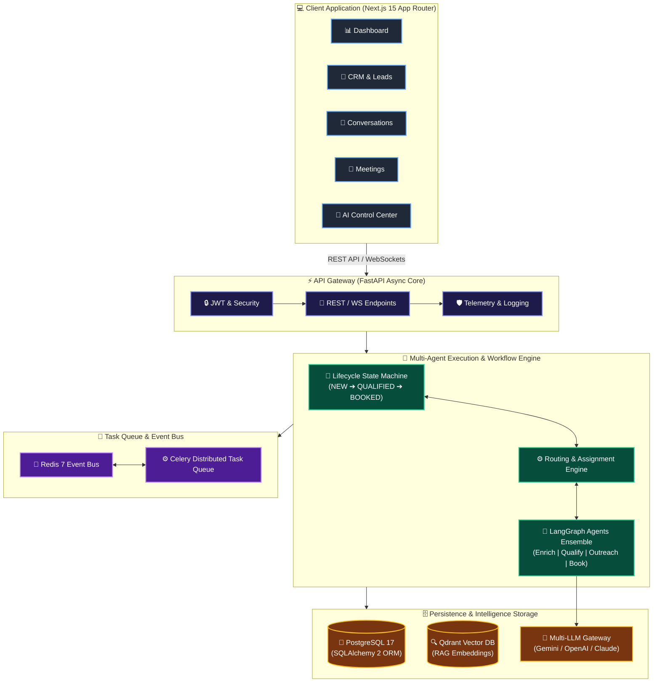

# SalesOS AI — System Architecture Specification

**Status**: **FROZEN** (Milestones 1–4 Finalized)  
**System Design**: Asynchronous Multi-Agent, Event-Driven, Microservices-Ready Monorepo  

---

## 1. High-Level System Architecture

---

## 2. Core Architectural Principles

1. **Determinism over Stochastic AI**: Business processes, state transitions, SLA breaches, and routing rules are 100% deterministic code. AI agents operate purely as advisory nodes inside workflows.
2. **Strict Layering**: Dependencies flow strictly downward (`API` ➔ `Services` ➔ `Workflows` ➔ `Decision Engine` ➔ `Agents` ➔ `Repositories` ➔ `Infrastructure`).
3. **Plugin Extensibility**: Agents, prompts, LLM providers, and tool providers are registered dynamically via registries (`AgentRegistry`, `PromptRegistry`, `ToolRegistry`).
4. **Human-in-the-Loop Guardrails**: High-value deals trigger approval gates before outreach dispatch.
5. **Full Auditability**: Every workflow state, decision rule evaluation, agent run, and API execution is recorded in persistent audit logs.

---

## 3. Data Model & Relationships

The database schema consists of 14 core PostgreSQL tables managed via SQLAlchemy 2 ORM and Alembic migrations:

- `users`: User accounts and roles.
- `organizations`: Multi-tenant organization boundaries.
- `leads`: Lead contact, firmographic, status, and score details.
- `companies`: Company profiles and technographic details.
- `activities`: Audit timeline log for CRM interactions.
- `agent_runs`: History of AI agent executions, inputs, outputs, tokens, latency.
- `api_keys`: Hashed organization API keys.
- `audit_logs`: Governance audit log.
- `conversations`: Multi-channel communication threads.
- `domain_events`: Persistent domain event store.
- `emails`: Outbound and inbound email records.
- `meetings`: Booked calendar demo events.
- `messages`: Individual email or chat messages.
- `workflow_instances`: Persisted state of deterministic workflow executions.
